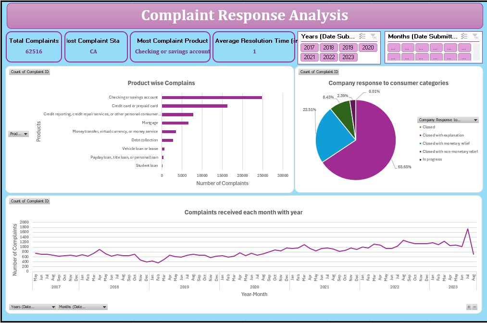

# 📊 Consumer Complaints Analysis Dashboard


---

## 📌 Project Overview

Developed an interactive Consumer Complaints Analysis Dashboard in Microsoft Excel to analyze complaint trends, product categories, customer responses, and resolution status. The dashboard enables businesses to monitor complaint volumes, identify recurring issues, and improve customer service performance through data-driven insights.

---

## 🎯 Objectives

- Analyze complaint trends over time
- Identify products with the highest complaints
- Evaluate complaint resolution performance
- Monitor customer response patterns
- Build an interactive reporting dashboard

---

## 🛠 Tools Used

- Microsoft Excel
- Pivot Tables
- Pivot Charts
- Slicers
- Conditional Formatting

---

## 📷 Dashboard Preview



---

## 📊 Dashboard Features

- Complaint Trend Analysis
- Product Category Analysis
- Company-wise Complaints
- Resolution Status
- Customer Response Analysis
- Interactive Filters and Slicers

---

## 💡 Business Insights

- Identified products receiving the highest number of complaints.
- Analyzed complaint resolution rates and customer response trends.
- Highlighted recurring issues to support process improvements.
- Enabled interactive reporting for better decision-making.

---

## 📂 Folder Structure

```text
03-Excel-Consumer-Complaints-Analysis
│
├── README.md
├── LICENSE
├── Dashboard
│   └── Consumer Complaints Analysis.xlsx
└── Images
    └── Dashboard.png
```

---

## 👨‍💻 Author

**Shivam Choudhry**
